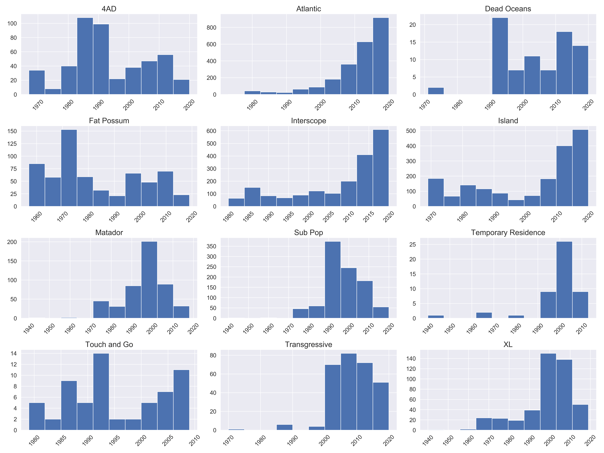
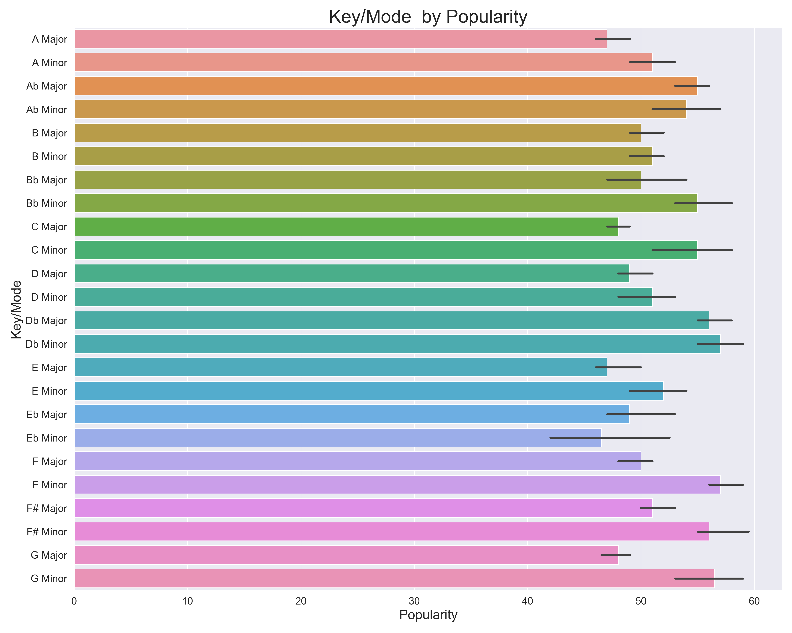
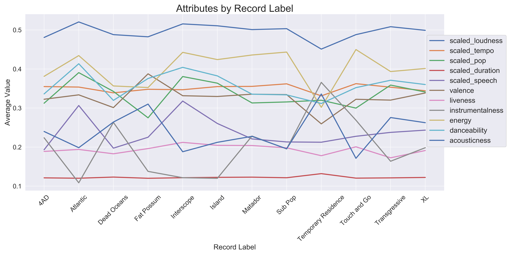
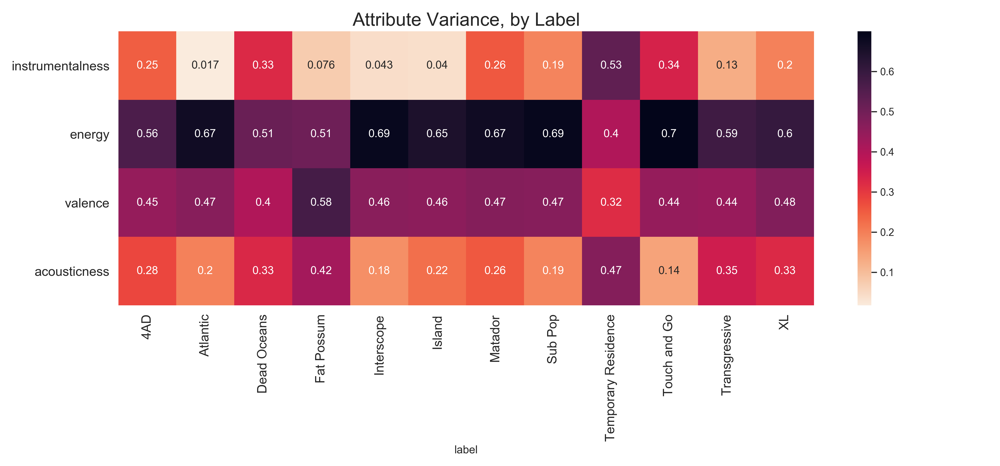
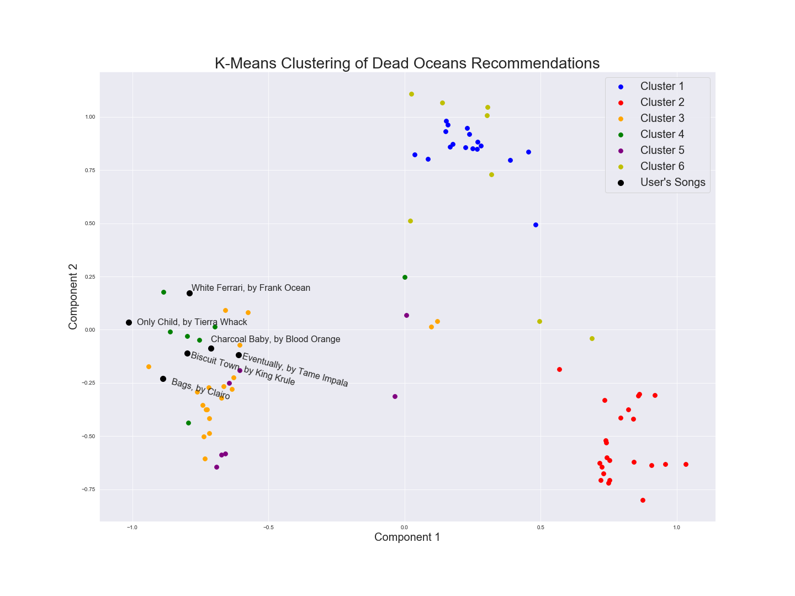
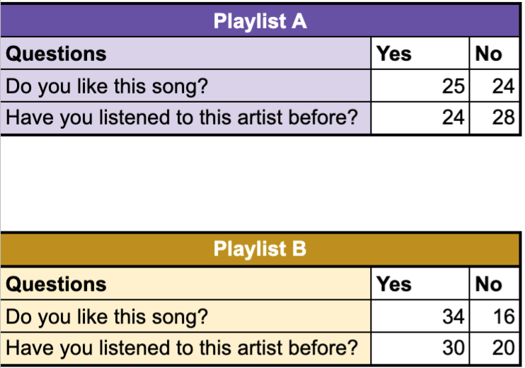

# Spotify Music Label Song Recommender
### By Justin Williams and Khyatee Desai

## Overview

The goal of this project was to build a Spotify recommendation engine for music record labels. The recommender takes in a users playlist, and generates a playlist with like songs from a specific record label. This enables the record label to promote their lesser-known artists, by showcasing songs that most closely align with a particular user's listening habits.
This recommendation system could be implemented directly on the record label's webpage, or as even as a feature on the label's Spotify page that automatically generates a custom playlist for the user.

Data used for this project was gathered from a variety of sources: 1) Record label artist roster data was sourced through web-scraping, 2) Spotify song database was obtained through Kaggle, 3) Additional information was gathered directly through the Spotify API. The methodologies utilized included data cleaning, outlier impution, exploratory data analysis (EDA) and utilization of both cosine similarity and KMeans clustering to create two distinct recommenders. Several Flatiron students and staff members submitted their playlists and recommendations were generated by each model. Participants were then asked to provide feedback each playlist. The results indicated that the K-Means clustering model performed better, both by providing better recommendations and introducing more unfamiliar artists. 

## Business Problem

Many music record labels need to get exposure for their artists. However, with the plethora of music available through streaming, it has become difficult for record labels to obtain new listeners. That said, wouldn't it be ideal if a record label could take a prospective listeners playlist and provide them with a personalized one composed entirely of songs from their artist roster? We thought so, that's why we created this music label song recommender. Subsequently, this enables prospective listeners to get a preview of a record labels product, specifically tailored to their favorite songs. This provides them with a personalized introduction to the record labels artist roster. 

## Data

The data used in this project was obtained from a few different sources. Record label roster data was scraped directly from each respective labels website. A dataset gathered from Spotify was downloaded from kaggle, and supplemented with information streamed directly from the Spotify API. The Spotify data contains audio features for each track, they are as follows:

| KEY              | VALUE TYPE | VALUE DESCRIPTION                                                                                                                                                                                                                                                                                                                                                                                                                                                                                                                                                               |
|------------------|------------|---------------------------------------------------------------------------------------------------------------------------------------------------------------------------------------------------------------------------------------------------------------------------------------------------------------------------------------------------------------------------------------------------------------------------------------------------------------------------------------------------------------------------------------------------------------------------------|
| duration_ms      | int        | The duration of the track in milliseconds.                                                                                                                                                                                                                                                                                                                                                                                                                                                                                                                                      |
| key              | int        | The estimated overall key of the track. Integers map to pitches using standard Pitch Class notation . E.g. 0 = C, 1 = C♯/D♭, 2 = D, and so on. If no key was detected, the value is -1.                                                                                                                                                                                                                                                                                                                                                                                         |
| mode             | int        | Mode indicates the modality (major or minor) of a track, the type of scale from which its melodic content is derived. Major is represented by 1 and minor is 0.                                                                                                                                                                                                                                                                                                                                                                                                                 |
| time_signature   | int        | An estimated overall time signature of a track. The time signature (meter) is a notational convention to specify how many beats are in each bar (or measure).                                                                                                                                                                                                                                                                                                                                                                                                                   |
| acousticness     | float      | A confidence measure from 0.0 to 1.0 of whether the track is acoustic. 1.0 represents high confidence the track is acoustic. The distribution of values for this feature look like this:#                                                                                                                                                                                                                                                                                                                                                                                       |
| danceability     | float      | Danceability describes how suitable a track is for dancing based on a combination of musical elements including tempo, rhythm stability, beat strength, and overall regularity. A value of 0.0 is least danceable and 1.0 is most danceable. The distribution of values for this feature look like this:#                                                                                                                                                                                                                                                                       |
| energy           | float      | Energy is a measure from 0.0 to 1.0 and represents a perceptual measure of intensity and activity. Typically, energetic tracks feel fast, loud, and noisy. For example, death metal has high energy, while a Bach prelude scores low on the scale. Perceptual features contributing to this attribute include dynamic range, perceived loudness, timbre, onset rate, and general entropy. The distribution of values for this feature look like this:#                                                                                                                          |
| instrumentalness | float      | Predicts whether a track contains no vocals. “Ooh” and “aah” sounds are treated as instrumental in this context. Rap or spoken word tracks are clearly “vocal”. The closer the instrumentalness value is to 1.0, the greater likelihood the track contains no vocal content. Values above 0.5 are intended to represent instrumental tracks, but confidence is higher as the value approaches 1.0. The distribution of values for this feature look like this:#                                                                                                                 |
| liveness         | float      | Detects the presence of an audience in the recording. Higher liveness values represent an increased probability that the track was performed live. A value above 0.8 provides strong likelihood that the track is live. The distribution of values for this feature look like this:#                                                                                                                                                                                                                                                                                            |
| loudness         | float      | The overall loudness of a track in decibels (dB). Loudness values are averaged across the entire track and are useful for comparing relative loudness of tracks. Loudness is the quality of a sound that is the primary psychological correlate of physical strength (amplitude). Values typical range between -60 and 0 db. The distribution of values for this feature look like this:#                                                                                                                                                                                       |
| speechiness      | float      | Speechiness detects the presence of spoken words in a track. The more exclusively speech-like the recording (e.g. talk show, audio book, poetry), the closer to 1.0 the attribute value. Values above 0.66 describe tracks that are probably made entirely of spoken words. Values between 0.33 and 0.66 describe tracks that may contain both music and speech, either in sections or layered, including such cases as rap music. Values below 0.33 most likely represent music and other non-speech-like tracks. The distribution of values for this feature look like this:# |
| valence          | float      | A measure from 0.0 to 1.0 describing the musical positiveness conveyed by a track. Tracks with high valence sound more positive (e.g. happy, cheerful, euphoric), while tracks with low valence sound more negative (e.g. sad, depressed, angry). The distribution of values for this feature look like this:#                                                                                                                                                                                                                                                                  |
| tempo            | float      | The overall estimated tempo of a track in beats per minute (BPM). In musical terminology, tempo is the speed or pace of a given piece and derives directly from the average beat duration. The distribution of values for this feature look like this:#                                                                                                                                                                                                                                                                                                                         |
| id               | string     | The Spotify ID for the track.                                                                                                                                                                                                                                                                                                                                                                                                                                                                                                                                                   |
| uri              | string     | The Spotify URI for the track.                                                                                                                                                                                                                                                                                                                                                                                                                                                                                                                                                  |
| track_href       | string     | A link to the Web API endpoint providing full details of the track.                                                                                                                                                                                                                                                                                                                                                                                                                                                                                                             |
| analysis_url     | string     | An HTTP URL to access the full audio analysis of this track. An access token is required to access this data.                                                                                                                                                                                                                                                                                                                                                                                                                                                                   |
| type             | string     | The object type: “audio_features”                                                                                                                                                                                                                                           

## Methods

The aforementioned song attributes from the Spotify API Audio Features Object, enabled us to calculate similarities between specific music record labels catalogs and users inputted playlists. Before calculating similarity metrics, data was preprocessed through the following pipeline: 
- Dropping of unnecessary features
- Feature engineering i.e. decade imputation, key/mode concatenation
- Outliers bought down to 5 standard deviations from mean
- Unscaled features scaled
- Dummy columns created for categorical
- Scraped record label data merged with Spotify data frame

Once preprocessing steps were complete, recommendations were generated with two distinct techniques:
1) **Cosine similarity** - Calculating cosine similarities between record label songs and users playlist. 
2) **KMeans Clustering** - Clustering record labels songs into k clusters and mapping users playlist to the most similar cluster.

## Results


### Song distribution by year, by label


### Key/Mode by popularity


### Song attribute by label


### Most variant song attributes


### Kmeans clustering


### A/B Test


To evaluate the performance of the recommenders, we conducted an A/B test with 13 participants: each person submitted a playlist of songs they enjoy, and received a playlist of songs generated by each of our recommendation models. They were then asked to listen to each playlist, and provide feedback on how many songs they enjoyed, and whether they had listened to the recommended artists before. Using this data, we were able to determine which model created "better" recommendations, and which model introduced people to a greater number of unfamiliar artists. The ideal model accomplishes both: it makes song recommendations that the user enjoys, and it helps introduce the user to new artists from a record label. 

From the A/B testing, we determined that participants enjoyed 69% of cluster-based recommendations, versus 51% from the cosine-similarity model. In addition, Participants enjoyed 56% of songs by unfamiliar artists from the cluster model, versus only 35% from the cosine-similarity model. In all, we found the K-means clustering model to be more effective at producing "good" recommendations, as well as introducing participants to new artists they enjoyed.

## Conclusion & Next Steps

Through this process, we determined that content-based recommendation using Spotify song attributes is moderately effective at created "good" song recommendations, as well as introducing people to unknown artists from a record label. 
Areas for improvement in this process include the following:
1. Include more record labels to capture different musical styles and genres 
2. Create a larger and more diverse record label song pool, encapsulating all of the record label's songs, rather than just those found on the Kaggle dataset we used. This would allow for much more nuanced and accurate recommendations to be made.
3. Incorporate User data into the models, to make review-based recommendations based on what other users "liked"

After further iterations, we believe this tool can provide significant value to record labels for the purpose of promoting their lesser-known artists.
## For More Information

Please review our full analysis in [our EDA notebook](./data_collection_and_eda.ipynb), [Modeling notebook](./modeling.ipynb) and [presentation](./slide_deck.pdf).

For any additional questions, please contact **Justin Williams - justinmorganwilliams@newschool.edu and Khyatee Desai - khyatee.d@gmail.com**

## Repository Structure

```
├── README.md                                    <- Top-level README for reviewers of this project
├── data_collection_and_eda.ipynb                <- Narrative documentation of analysis in Jupyter notebook
├── modeling.ipynb                               <- Modeling and recommender in Jupyter notebook
├── slide_deck.pdf                               <- PDF version of project presentation
├── data                                         <- Both sourced externally and generated from code
└── images                                       <- Both sourced externally and generated from code
```


